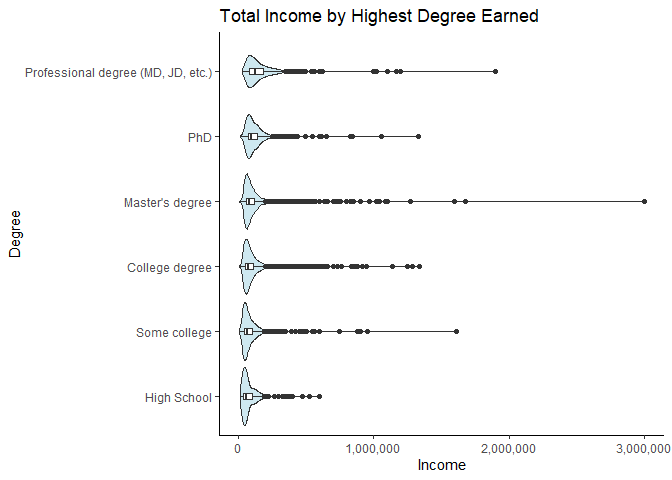
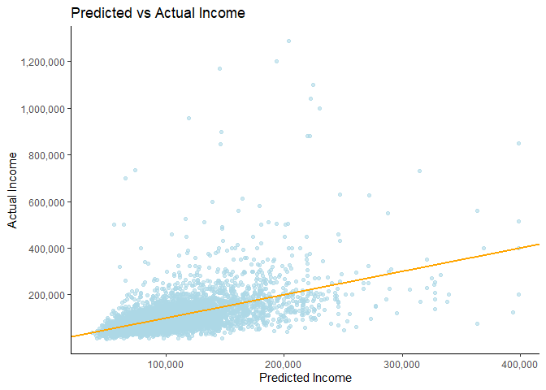

Ask a Manager Salary Survey
================
Matt
5/30/2021

``` r
pacman::p_load(tidyverse, tidymodels, lubridate, janitor, naniar)
theme_set(theme_classic())
```

## Read in Data

``` r
survey <- readr::read_csv('https://raw.githubusercontent.com/rfordatascience/tidytuesday/master/data/2021/2021-05-18/survey.csv') %>% 
  clean_names()
```

    ## 
    ## -- Column specification --------------------------------------------------------
    ## cols(
    ##   timestamp = col_character(),
    ##   how_old_are_you = col_character(),
    ##   industry = col_character(),
    ##   job_title = col_character(),
    ##   additional_context_on_job_title = col_character(),
    ##   annual_salary = col_double(),
    ##   other_monetary_comp = col_character(),
    ##   currency = col_character(),
    ##   currency_other = col_character(),
    ##   additional_context_on_income = col_character(),
    ##   country = col_character(),
    ##   state = col_character(),
    ##   city = col_character(),
    ##   overall_years_of_professional_experience = col_character(),
    ##   years_of_experience_in_field = col_character(),
    ##   highest_level_of_education_completed = col_character(),
    ##   gender = col_character(),
    ##   race = col_character()
    ## )

``` r
survey <- survey %>% 
  select(-timestamp) %>% 
  distinct()
```

``` r
summary(survey)
```

    ##  how_old_are_you      industry          job_title        
    ##  Length:26084       Length:26084       Length:26084      
    ##  Class :character   Class :character   Class :character  
    ##  Mode  :character   Mode  :character   Mode  :character  
    ##                                                          
    ##                                                          
    ##                                                          
    ##  additional_context_on_job_title annual_salary       other_monetary_comp
    ##  Length:26084                    Min.   :        0   Length:26084       
    ##  Class :character                1st Qu.:    54000   Class :character   
    ##  Mode  :character                Median :    75708   Mode  :character   
    ##                                  Mean   :   146029                      
    ##                                  3rd Qu.:   110000                      
    ##                                  Max.   :870000000                      
    ##    currency         currency_other     additional_context_on_income
    ##  Length:26084       Length:26084       Length:26084                
    ##  Class :character   Class :character   Class :character            
    ##  Mode  :character   Mode  :character   Mode  :character            
    ##                                                                    
    ##                                                                    
    ##                                                                    
    ##    country             state               city          
    ##  Length:26084       Length:26084       Length:26084      
    ##  Class :character   Class :character   Class :character  
    ##  Mode  :character   Mode  :character   Mode  :character  
    ##                                                          
    ##                                                          
    ##                                                          
    ##  overall_years_of_professional_experience years_of_experience_in_field
    ##  Length:26084                             Length:26084                
    ##  Class :character                         Class :character            
    ##  Mode  :character                         Mode  :character            
    ##                                                                       
    ##                                                                       
    ##                                                                       
    ##  highest_level_of_education_completed    gender              race          
    ##  Length:26084                         Length:26084       Length:26084      
    ##  Class :character                     Class :character   Class :character  
    ##  Mode  :character                     Mode  :character   Mode  :character  
    ##                                                                            
    ##                                                                            
    ## 

``` r
head(survey)
```

    ## # A tibble: 6 x 17
    ##   how_old_are_you industry      job_title       additional_contex~ annual_salary
    ##   <chr>           <chr>         <chr>           <chr>                      <dbl>
    ## 1 25-34           Education (H~ Research and I~ <NA>                       55000
    ## 2 25-34           Computing or~ Change & Inter~ <NA>                       54600
    ## 3 25-34           Accounting, ~ Marketing Spec~ <NA>                       34000
    ## 4 25-34           Nonprofits    Program Manager <NA>                       62000
    ## 5 25-34           Accounting, ~ Accounting Man~ <NA>                       60000
    ## 6 25-34           Education (H~ Scholarly Publ~ <NA>                       62000
    ## # ... with 12 more variables: other_monetary_comp <chr>, currency <chr>,
    ## #   currency_other <chr>, additional_context_on_income <chr>, country <chr>,
    ## #   state <chr>, city <chr>, overall_years_of_professional_experience <chr>,
    ## #   years_of_experience_in_field <chr>,
    ## #   highest_level_of_education_completed <chr>, gender <chr>, race <chr>

``` r
miss_var_summary(survey) %>% 
  ggplot(aes(x = pct_miss / 100, y = reorder(variable, pct_miss))) +
  geom_col(fill = "lightblue") +
  scale_x_continuous(labels = scales::percent) +
  labs(title = "Missingness of Variables", y = "Variable", x = "Percent Missing")
```

<!-- -->

``` r
survey <- survey %>% 
  mutate(other_monetary_comp = as.numeric(other_monetary_comp)) %>% 
  select(-c(currency_other))
```

## Data Cleaning

### Currency and Country

``` r
survey %>% 
  count(currency) %>% 
  arrange(desc(n))
```

    ## # A tibble: 11 x 2
    ##    currency     n
    ##    <chr>    <int>
    ##  1 USD      21721
    ##  2 CAD       1557
    ##  3 GBP       1517
    ##  4 EUR        583
    ##  5 AUD/NZD    465
    ##  6 Other      133
    ##  7 CHF         35
    ##  8 SEK         34
    ##  9 JPY         22
    ## 10 ZAR         13
    ## 11 HKD          4

``` r
survey %>% 
  count(country) %>% 
  arrange(desc(n))
```

    ## # A tibble: 294 x 2
    ##    country                      n
    ##    <chr>                    <int>
    ##  1 United States             8935
    ##  2 USA                       7891
    ##  3 US                        2467
    ##  4 Canada                    1536
    ##  5 United Kingdom             581
    ##  6 UK                         579
    ##  7 U.S.                       567
    ##  8 United States of America   423
    ##  9 Usa                        418
    ## 10 Australia                  366
    ## # ... with 284 more rows

For this analysis I will only work with data that is expressed in USD
and the respondents are from the United States. This accounts for 21,532
rows out of the original 26,084 in the dataset (after removing
duplicates).

``` r
survey <- survey %>% 
  filter(currency == "USD")
```

``` r
united_states_values <- c("us", "america", "America", "California", "For the United States government, but posted overseas",
                          "I work for a UAE-based organization, though I am personally in the US.",
                          "Japan, US Gov position", "San Francisco", "The US", "U. S", "U. S.", "U.S", "U.A.", "U.S",
                          "u.s.", "U.s.", "U.S.", "U.S.A", "U.s.a.", "U.S.A.", "U.S>", "U.SA", "UA", "Uniited States",
                          "Unite States", "United  States", "United Sates", "United Sates of America", "United Stares",
                          "United State", "United State of America", "United Statea", "united stated", "United Stated", 
                          "United Stateds", "United Statees", "united states", "united States", "United states",
                          "United States", "United STates", "UNITED STATES", "United States- Puerto Rico", 
                          "United States (I work from home and my clients are all over the US/Canada/PR",
                          "united states of america", "United states of america", "United states of America",
                          "United States of america", "United States of America", "United States Of America", 
                          "United States of American", "United States of Americas", "United Statesp", 
                          "United statew", "United Statss", "United Stattes", "United Statues", 
                          "United Status", "United Statws", "United Sttes", "UnitedStates", "Uniteed States",
                          "Unitef Stated", "Uniter Statez", "Unites states", "Unites States", "Unitied States",
                          "Uniyed states", "Uniyes States", "Unted States", "Untied States", "us", "uS", "Us", "US",
                          "US govt employee overseas, country withheld", "US of A", "usa", "uSA", "Usa", "UsA", "USA",
                          "USA-- Virgin Islands", "USA (company is based in a US territory, I work remote)",
                          "USA tomorrow", "USA, but for foreign gov't", "USaa", "USAB", "Usat", "USD", "USS", "Virginia",
                          "Worldwide (based in US but short term trips aroudn the world)")
```

``` r
survey <- survey %>% 
  filter(country %in% united_states_values)
```

### Other Monetary Comp

``` r
summary(survey$other_monetary_comp)
```

    ##    Min. 1st Qu.  Median    Mean 3rd Qu.    Max.    NA's 
    ##       0       0    2000   12536   10000 1400000    5362

``` r
survey %>% 
  ggplot(aes(x = other_monetary_comp)) +
  geom_boxplot(fill = "lightblue") +
  scale_x_continuous(labels = scales::comma) +
  scale_y_continuous(breaks = NULL) +
  labs(title = "Other Monetary Compensation Given", x = "Compensation")
```

    ## Warning: Removed 5362 rows containing non-finite values (stat_boxplot).

<!-- -->

``` r
survey %>% 
  filter(annual_salary < 250000 & other_monetary_comp > 500000)
```

    ## # A tibble: 9 x 16
    ##   how_old_are_you industry      job_title     additional_context_~ annual_salary
    ##   <chr>           <chr>         <chr>         <chr>                        <dbl>
    ## 1 45-54           Computing or~ Senior Produ~ <NA>                        238000
    ## 2 35-44           Engineering ~ Director of ~ Machine learning an~        246000
    ## 3 35-44           Computing or~ Product Mana~ <NA>                        135000
    ## 4 25-34           Computing or~ UX Designer   UX generalist; mult~        140000
    ## 5 35-44           Computing or~ Data Scienti~ <NA>                        220000
    ## 6 25-34           Accounting, ~ Security Eng~ <NA>                        215000
    ## 7 35-44           Computing or~ Staff Softwa~ <NA>                        243200
    ## 8 25-34           Computing or~ Senior Busin~ <NA>                        136000
    ## 9 45-54           Computing or~ Principal Pr~ <NA>                        240000
    ## # ... with 11 more variables: other_monetary_comp <dbl>, currency <chr>,
    ## #   additional_context_on_income <chr>, country <chr>, state <chr>, city <chr>,
    ## #   overall_years_of_professional_experience <chr>,
    ## #   years_of_experience_in_field <chr>,
    ## #   highest_level_of_education_completed <chr>, gender <chr>, race <chr>

Some of this data still looks incorrect just glancing over it. But
reading the additional context on where their income is coming from
makes sense. However, there is still a typo that needs to be corrected
where total salary is said to be 230,000 in the additional context
column but annual salary is 90,000 and other monetary comp is 900,000.
There was an extra 0 added to other monetary comp.

``` r
survey <- survey %>% 
  mutate(other_monetary_comp = ifelse(annual_salary == 140000 & other_monetary_comp == 900000,
                                      90000, other_monetary_comp))
```

If there is no other monetary compensation listed, I will fill in those
values with 0.

``` r
survey <- survey %>% 
  mutate(other_monetary_comp = ifelse(is.na(other_monetary_comp), 0 , other_monetary_comp))
```

### State

``` r
survey %>% 
  count(state) %>% 
  arrange(desc(n))
```

    ## # A tibble: 125 x 2
    ##    state                    n
    ##    <chr>                <int>
    ##  1 California            2410
    ##  2 New York              2024
    ##  3 Massachusetts         1440
    ##  4 Texas                 1163
    ##  5 Illinois              1117
    ##  6 Washington            1110
    ##  7 District of Columbia   944
    ##  8 Pennsylvania           877
    ##  9 Virginia               725
    ## 10 Minnesota              667
    ## # ... with 115 more rows

Some people included multiple states. I will only look at the first
state that they selected. There are also some data points where state is
missing, I will fill these in with “Not available” values.

``` r
survey <- survey %>% 
  mutate(state = ifelse(is.na(state), "Not available", state))
```

``` r
survey <- survey %>% 
  separate(state, into = c("state", NULL), sep = ",")
```

    ## Warning: Expected 1 pieces. Additional pieces discarded in 96 rows [1957, 2000,
    ## 2044, 2474, 2480, 2587, 2636, 2646, 2660, 2797, 2800, 3193, 3377, 3441, 3470,
    ## 3516, 4090, 4463, 4485, 4631, ...].

``` r
survey %>% 
  count(state) %>% 
  ggplot(aes(x = n, y = reorder(state, n))) +
  geom_col(fill = "lightblue") +
  scale_x_continuous(labels = scales::comma) +
  labs(title = "Responses From Each State", y = "State", x = "# responses")
```

<!-- -->

A majority of respondents are from California and New York, which makes
sense as they are the two of the biggest states in the country.

### Level of Education

``` r
survey %>% 
  count(highest_level_of_education_completed) %>% 
  ggplot(aes(x = n, y = reorder(highest_level_of_education_completed, n))) +
  geom_col(fill = "lightblue") +
  scale_x_continuous(labels = scales::comma) +
  labs(title = "Amount of Schooling Completed", y = "Level of School", x = "# responses")
```

<!-- -->

A majority of managers have completed at least one college degree. Since
there is a very small amount of data points missing from the highest
level of education variable, I will drop the missing rows.

``` r
survey <- survey %>% 
  drop_na(highest_level_of_education_completed)
```

### Gender

``` r
survey %>% 
  count(gender)
```

    ## # A tibble: 6 x 2
    ##   gender                            n
    ## * <chr>                         <int>
    ## 1 Man                            3624
    ## 2 Non-binary                      564
    ## 3 Other or prefer not to answer   215
    ## 4 Prefer not to answer              1
    ## 5 Woman                         16895
    ## 6 <NA>                             99

``` r
survey <- survey %>% 
  mutate(gender = case_when(gender == "Prefer not to answer" ~ "Other or prefer not to answer",
                            TRUE ~ gender))
```

``` r
survey %>% 
  count(gender) %>% 
  ggplot(aes(x = n, y = reorder(gender, n))) +
  geom_col(fill = "lightblue") +
  scale_x_continuous(labels = scales::comma) + 
  labs("Gender of Survey Respondents", y = "Gender", x = "# respondents")
```

<!-- -->

Again, the number of missing values for the gender column is small, so
these values will be dropped. Something to note is that a large
percentage of the respondents to the survey identified as women.

``` r
survey <- survey %>% 
  drop_na(gender)
```

### Race

``` r
survey %>% 
  count(race)
```

    ## # A tibble: 44 x 2
    ##    race                                                                        n
    ##  * <chr>                                                                   <int>
    ##  1 Another option not listed here or prefer not to answer                    404
    ##  2 Asian or Asian American                                                   945
    ##  3 Asian or Asian American, Another option not listed here or prefer not ~     5
    ##  4 Asian or Asian American, Black or African American                          7
    ##  5 Asian or Asian American, Black or African American, Hispanic, Latino, ~     1
    ##  6 Asian or Asian American, Black or African American, Native American or~     1
    ##  7 Asian or Asian American, Black or African American, White                   3
    ##  8 Asian or Asian American, Hispanic, Latino, or Spanish origin               11
    ##  9 Asian or Asian American, Hispanic, Latino, or Spanish origin, Another ~     1
    ## 10 Asian or Asian American, Hispanic, Latino, or Spanish origin, Native A~     1
    ## # ... with 34 more rows

The race variable has 44 different unique values when only 7 values were
given as an option. Many people selected more than one race. To solve
this I will create a new column, which will have the original value if
the respondent only selected one race and a new value that indicates if
the respondent selected multiple races. There is also only a small
amount of missing values so I will drop those.

``` r
survey <- survey %>% 
  drop_na(race)
```

``` r
survey <- survey %>% 
  separate(race, into = c("race", "race_1"), sep = ",") %>% 
  mutate(race = case_when(race_1 == " Latino" ~ "Hispanic, Latino, or Spanish origin",
                           TRUE ~ race),
         race_1 = ifelse(race_1 == " Latino", NA, race_1),
         race_1 = ifelse(is.na(race_1), "One race selected", "More than one race selected")) %>%
  mutate(race = case_when(race_1 == "More than one race selected" ~ race_1,
                          TRUE ~ race)) %>% 
  select(-race_1) 
```

    ## Warning: Expected 2 pieces. Additional pieces discarded in 883 rows [9, 11, 39,
    ## 47, 87, 128, 129, 138, 175, 183, 196, 237, 300, 329, 345, 362, 363, 398, 399,
    ## 411, ...].

    ## Warning: Expected 2 pieces. Missing pieces filled with `NA` in 19776 rows [1, 2,
    ## 3, 4, 5, 6, 7, 8, 10, 13, 14, 15, 16, 17, 18, 19, 20, 21, 22, 23, ...].

``` r
survey %>% 
  count(race) %>% 
  ggplot(aes(x = n, y = reorder(race, n))) +
  geom_col(fill = "lightblue") +
  scale_x_continuous(labels = scales::comma) +
  labs(title = "Race of Survey Respondents", y = "Race", x = "# respondents")
```

<!-- -->

A large majority of of survey respondents were white.

### Industry

``` r
survey %>% 
  count(industry) %>% 
  arrange(desc(n))
```

    ## # A tibble: 910 x 2
    ##    industry                                 n
    ##    <chr>                                <int>
    ##  1 Computing or Tech                     3399
    ##  2 Nonprofits                            2016
    ##  3 Education (Higher Education)          1950
    ##  4 Health care                           1462
    ##  5 Accounting, Banking & Finance         1344
    ##  6 Government and Public Administration  1340
    ##  7 Engineering or Manufacturing          1254
    ##  8 Law                                    896
    ##  9 Marketing, Advertising & PR            838
    ## 10 Education (Primary/Secondary)          676
    ## # ... with 900 more rows

I am going to replace missing values with Not available. Since there are
a lot of different values, I am going to create a new variable where
only the top 25 occurring values are kept and all other values become a
new “Other” value.

``` r
survey <- survey %>% 
  mutate(industry = ifelse(is.na(industry), "Not available", industry))
```

``` r
survey <- survey %>% 
  mutate(industry_lump = fct_lump_n(industry, n = 25))
```

``` r
survey %>% 
  count(industry_lump) %>% 
  ggplot(aes(x = n, reorder(industry_lump, n))) +
  geom_col(fill = "lightblue") +
  scale_x_continuous(labels = scales::comma) +
  labs(title = "Industry of Survey Respondents", y = "Industry", x = "# respondents")
```

<!-- -->

A majority of the respondents work in computing/tech, nonprofits or
higher education.

### City

``` r
survey %>% 
  distinct(city) %>% 
  count()
```

    ## # A tibble: 1 x 1
    ##       n
    ##   <int>
    ## 1  3141

There are 3,245 unique values in the city column. Since we already have
a state column that gives a good indication of the respondents
geographic location this column will be dropped.

``` r
survey <- survey %>% 
  select(-city)
```

### Salary variable

Annual salary and other monetary compensation will be added together to
compute a respondents total income for the year.

``` r
survey <- survey %>% 
  mutate(total_income = annual_salary + other_monetary_comp)
```

``` r
summary(survey$total_income)
```

    ##    Min. 1st Qu.  Median    Mean 3rd Qu.    Max. 
    ##       0   58000   81000  101200  120000 3000000

``` r
survey %>% 
  ggplot(aes(y = total_income)) +
  geom_boxplot(fill = "lightblue") +
  scale_y_continuous(labels = scales::comma) +
  scale_x_continuous(breaks = NULL) +
  labs(title = "Total income of Repsondents", y = "Income")
```

<!-- -->

``` r
survey %>% 
  filter(total_income > 1000000)
```

    ## # A tibble: 21 x 17
    ##    how_old_are_you industry     job_title       additional_contex~ annual_salary
    ##    <chr>           <chr>        <chr>           <chr>                      <dbl>
    ##  1 35-44           Computing o~ Software Devel~ <NA>                      250000
    ##  2 55-64           Art & Design Owner and CEO   <NA>                     3000000
    ##  3 25-34           Engineering~ Software Engin~ <NA>                     1100000
    ##  4 25-34           Health care  Attending Phys~ <NA>                     1900000
    ##  5 25-34           Computing o~ Principal Soft~ <NA>                     1650000
    ##  6 35-44           Government ~ Senior Policy ~ <NA>                     1334782
    ##  7 45-54           Law          Partner         <NA>                     1200000
    ##  8 35-44           Computing o~ Product Manager <NA>                      135000
    ##  9 35-44           Law          Partner         <NA>                     1100000
    ## 10 25-34           Business or~ Senior Consult~ Consultant in the~       1260000
    ## # ... with 11 more rows, and 12 more variables: other_monetary_comp <dbl>,
    ## #   currency <chr>, additional_context_on_income <chr>, country <chr>,
    ## #   state <chr>, overall_years_of_professional_experience <chr>,
    ## #   years_of_experience_in_field <chr>,
    ## #   highest_level_of_education_completed <chr>, gender <chr>, race <chr>,
    ## #   industry_lump <fct>, total_income <dbl>

Do more digging into total income and possible extreme points later.

### Extra Data Cleaning for Uniformness

``` r
survey <- survey %>% 
  mutate(how_old_are_you = str_trim(how_old_are_you),
         how_old_are_you = str_squish(how_old_are_you),
         overall_years_of_professional_experience = 
           case_when(overall_years_of_professional_experience == "1 year or less" ~ "Under 2",
                     overall_years_of_professional_experience == "2 - 4 years" ~ "2-4",
                     overall_years_of_professional_experience == "5-7 years" ~ "5-7",
                     overall_years_of_professional_experience == "8 - 10 years" ~ "8-10",
                     overall_years_of_professional_experience == "11 - 20 years" ~ "11-20",
                     overall_years_of_professional_experience == "21 - 30 years" ~ "21-30",
                     overall_years_of_professional_experience == "31 - 40 years" ~ "31-40",
                     overall_years_of_professional_experience == "41 years or more" ~ "Over 41",
                     TRUE ~ overall_years_of_professional_experience),
         years_of_experience_in_field = 
           case_when(years_of_experience_in_field == "1 year or less" ~ "Under 2",
                     years_of_experience_in_field == "2 - 4 years" ~ "2-4",
                     years_of_experience_in_field == "5-7 years" ~ "5-7",
                     years_of_experience_in_field == "8 - 10 years" ~ "8-10",
                     years_of_experience_in_field == "11 - 20 years" ~ "11-20",
                     years_of_experience_in_field == "21 - 30 years" ~ "21-30",
                     years_of_experience_in_field == "31 - 40 years" ~ "31-40",
                     years_of_experience_in_field == "41 years or more" ~ "Over 41",
                     TRUE ~ years_of_experience_in_field))
```

``` r
survey <- survey %>% 
  mutate(how_old_are_you = factor(how_old_are_you, levels = c("under 18", "18-24",
                                                              "25-34", "35-44", "45-54",
                                                              "55-64", "65 or over"), ordered = TRUE),
         overall_years_of_professional_experience = factor(overall_years_of_professional_experience,
                                                           levels = c("Under 2", "2-4", "5-7", "8-10",
                                                                      "11-20", "21-30", "31-40", "Over 41"),
                                                           ordered = TRUE),
         years_of_experience_in_field = factor(years_of_experience_in_field,
                                               levels = c("Under 2", "2-4", "5-7", "8-10",
                                                          "11-20", "21-30", "31-40", "Over 41"),
                                               ordered = TRUE),
         industry_lump = factor(industry_lump),
         state = factor(state),
         highest_level_of_education_completed = factor(highest_level_of_education_completed,
                                                       levels = c("High School", "Some college",
                                                                  "College degree", "Master's degree", 
                                                                  "Professional degree (MD, JD, etc.)",
                                                                  "PhD"), ordered = TRUE),
         gender = factor(gender),
         race = factor(race))
```

## Data Exploration

``` r
summary(survey)
```

    ##    how_old_are_you   industry          job_title        
    ##  under 18  :   8   Length:21224       Length:21224      
    ##  18-24     : 791   Class :character   Class :character  
    ##  25-34     :9354   Mode  :character   Mode  :character  
    ##  35-44     :7701                                        
    ##  45-54     :2497                                        
    ##  55-64     : 791                                        
    ##  65 or over:  82                                        
    ##  additional_context_on_job_title annual_salary     other_monetary_comp
    ##  Length:21224                    Min.   :      0   Min.   :      0    
    ##  Class :character                1st Qu.:  56383   1st Qu.:      0    
    ##  Mode  :character                Median :  78618   Median :      0    
    ##                                  Mean   :  91818   Mean   :   9382    
    ##                                  3rd Qu.: 112000   3rd Qu.:   6000    
    ##                                  Max.   :3000000   Max.   :1400000    
    ##                                                                       
    ##    currency         additional_context_on_income   country         
    ##  Length:21224       Length:21224                 Length:21224      
    ##  Class :character   Class :character             Class :character  
    ##  Mode  :character   Mode  :character             Mode  :character  
    ##                                                                    
    ##                                                                    
    ##                                                                    
    ##                                                                    
    ##            state       overall_years_of_professional_experience
    ##  California   : 2388   11-20  :7492                            
    ##  New York     : 1997   8-10   :4062                            
    ##  Massachusetts: 1421   5-7    :3591                            
    ##  Texas        : 1143   21-30  :2849                            
    ##  Illinois     : 1101   2-4    :2117                            
    ##  Washington   : 1097   31-40  : 677                            
    ##  (Other)      :12077   (Other): 436                            
    ##  years_of_experience_in_field
    ##  11-20  :5117                
    ##  5-7    :4976                
    ##  2-4    :4475                
    ##  8-10   :3879                
    ##  21-30  :1470                
    ##  Under 2: 964                
    ##  (Other): 343                
    ##                  highest_level_of_education_completed
    ##  High School                       :  347            
    ##  Some college                      : 1451            
    ##  College degree                    :10366            
    ##  Master's degree                   : 6958            
    ##  Professional degree (MD, JD, etc.): 1064            
    ##  PhD                               : 1038            
    ##                                                      
    ##                            gender     
    ##  Man                          : 3611  
    ##  Non-binary                   :  563  
    ##  Other or prefer not to answer:  211  
    ##  Woman                        :16839  
    ##                                       
    ##                                       
    ##                                       
    ##                                                      race      
    ##  White                                                 :17822  
    ##  Asian or Asian American                               :  945  
    ##  Hispanic, Latino, or Spanish origin                   :  804  
    ##  More than one race selected                           :  644  
    ##  Black or African American                             :  527  
    ##  Another option not listed here or prefer not to answer:  404  
    ##  (Other)                                               :   78  
    ##                        industry_lump   total_income    
    ##  Computing or Tech            :3399   Min.   :      0  
    ##  Nonprofits                   :2016   1st Qu.:  58000  
    ##  Education (Higher Education) :1950   Median :  81000  
    ##  Other                        :1748   Mean   : 101200  
    ##  Health care                  :1462   3rd Qu.: 120000  
    ##  Accounting, Banking & Finance:1344   Max.   :3000000  
    ##  (Other)                      :9305

``` r
survey %>% 
  filter(total_income < 10000) %>% 
  select(state, job_title, overall_years_of_professional_experience, total_income)
```

    ## # A tibble: 58 x 4
    ##    state          job_title           overall_years_of_professiona~ total_income
    ##    <fct>          <chr>               <ord>                                <dbl>
    ##  1 Maryland       Quality Assurance ~ 21-30                                   58
    ##  2 Idaho          Special Education ~ 21-30                                   38
    ##  3 Maryland       Managing Editor     5-7                                     61
    ##  4 New Mexico     Chief Data Scienti~ 8-10                                   130
    ##  5 North Carolina freelance captioner 11-20                                 4000
    ##  6 West Virginia  Operations Manager  31-40                                   35
    ##  7 Minnesota      Engineering Superv~ 11-20                                 5108
    ##  8 District of C~ Assistant Registrar 2-4                                     40
    ##  9 Missouri       Regional Manager    21-30                                   70
    ## 10 Massachusetts  Manager             11-20                                  155
    ## # ... with 48 more rows

``` r
survey <- survey %>% 
  filter(total_income > 10000)
```

``` r
survey %>% 
  group_by(gender, race) %>% 
  count() %>% 
  arrange(desc(n))
```

    ## # A tibble: 30 x 3
    ## # Groups:   gender, race [30]
    ##    gender     race                                                       n
    ##    <fct>      <fct>                                                  <int>
    ##  1 Woman      White                                                  14202
    ##  2 Man        White                                                   3025
    ##  3 Woman      Asian or Asian American                                  737
    ##  4 Woman      Hispanic, Latino, or Spanish origin                      607
    ##  5 Woman      More than one race selected                              507
    ##  6 Non-binary White                                                    455
    ##  7 Woman      Black or African American                                443
    ##  8 Woman      Another option not listed here or prefer not to answer   247
    ##  9 Man        Asian or Asian American                                  172
    ## 10 Man        Hispanic, Latino, or Spanish origin                      170
    ## # ... with 20 more rows

The dataset mostly includes data from white females. Most respondents to
the survey have at least a college degree and are between the ages of 25
and 44.

``` r
survey %>% 
  ggplot(aes(x = total_income, y = how_old_are_you)) +
  geom_violin(fill = "lightblue",  alpha = 0.6) +
  geom_boxplot(width = 0.1) +
  scale_x_continuous(labels = scales::comma) +
  labs(title = "Total Income By Age Group", y = "Age Group", x ="Income")
```

<!-- -->

``` r
summary(aov(survey$total_income ~ survey$how_old_are_you))
```

    ##                           Df    Sum Sq   Mean Sq F value Pr(>F)    
    ## survey$how_old_are_you     6 3.033e+12 5.056e+11   75.12 <2e-16 ***
    ## Residuals              21159 1.424e+14 6.730e+09                   
    ## ---
    ## Signif. codes:  0 '***' 0.001 '**' 0.01 '*' 0.05 '.' 0.1 ' ' 1

From the one-way ANOVA test it seems like there are significant
differences in total income received between different age groups as the
p-value is extremely low. It might be interesting to look at total years
of experience and years of experience in their current field to see if
there is significance there as well.

``` r
survey %>% 
  ggplot(aes(x = total_income, y = overall_years_of_professional_experience)) +
  geom_violin(fill = "lightblue",  alpha = 0.6) +
  geom_boxplot(width = 0.1) +
  scale_x_continuous(labels = scales::comma) +
  labs(title = "Total Income By Overall Experience", y = "Overall Experience (Years)", x ="Income")
```

<!-- -->

``` r
summary(aov(survey$total_income ~ survey$overall_years_of_professional_experience))
```

    ##                                                    Df    Sum Sq   Mean Sq
    ## survey$overall_years_of_professional_experience     7 3.973e+12 5.676e+11
    ## Residuals                                       21158 1.415e+14 6.686e+09
    ##                                                 F value Pr(>F)    
    ## survey$overall_years_of_professional_experience    84.9 <2e-16 ***
    ## Residuals                                                         
    ## ---
    ## Signif. codes:  0 '***' 0.001 '**' 0.01 '*' 0.05 '.' 0.1 ' ' 1

``` r
survey %>% 
  ggplot(aes(x = total_income, y = years_of_experience_in_field)) +
  geom_violin(fill = "lightblue",  alpha = 0.6) +
  geom_boxplot(width = 0.1) +
  scale_x_continuous(labels = scales::comma) +
  labs(title = "Total Income By Experience in Field", y = "Experience in Field (Years)", x ="Income")
```

<!-- -->

``` r
summary(aov(survey$total_income ~ survey$years_of_experience_in_field))
```

    ##                                        Df    Sum Sq   Mean Sq F value Pr(>F)
    ## survey$years_of_experience_in_field     7 7.686e+12 1.098e+12   168.7 <2e-16
    ## Residuals                           21158 1.377e+14 6.510e+09               
    ##                                        
    ## survey$years_of_experience_in_field ***
    ## Residuals                              
    ## ---
    ## Signif. codes:  0 '***' 0.001 '**' 0.01 '*' 0.05 '.' 0.1 ' ' 1

There is also significance observed between groups for overall years of
experience and years of experience in their current field.

``` r
survey %>% 
  ggplot(aes(x = total_income, y = reorder(race, total_income))) +
  geom_violin(fill = "lightblue", alpha = 0.6) +
  geom_boxplot(width = 0.1) +
  scale_x_continuous(labels = scales::comma) +
  labs(title = "Total Income by Race", y = "Race", x = "Income")
```

<!-- -->

``` r
survey %>% 
  ggplot(aes(x = total_income, y = reorder(gender, total_income))) +
  geom_violin(fill = "lightblue", alpha = 0.6) +
  geom_boxplot(width = 0.1) +
  scale_x_continuous(labels = scales::comma) +
  labs(title = "Total Income by Gender", y = "Gender", x = "Income")
```

<!-- -->

The distribution of incomes to different races is pretty similar, but
white respondents seem to have many more extreme values where their
total income is much greater than other groups. When looking at gender,
men seem to have the highest total income out of the groups.

``` r
summary(aov(survey$total_income ~ survey$race + survey$gender))
```

    ##                  Df    Sum Sq   Mean Sq F value Pr(>F)    
    ## survey$race       7 7.323e+11 1.046e+11   16.02 <2e-16 ***
    ## survey$gender     3 6.517e+12 2.172e+12  332.60 <2e-16 ***
    ## Residuals     21155 1.382e+14 6.532e+09                   
    ## ---
    ## Signif. codes:  0 '***' 0.001 '**' 0.01 '*' 0.05 '.' 0.1 ' ' 1

With a two-way ANOVA test using race and gender to model total income,
both variables are statistically significant with low p-values. The
f-value for gender is much higher than the f-value for gender which
means that the variation caused by the independent variable is less
likely due to chance.

``` r
survey %>% 
  ggplot(aes(x = total_income, y = reorder(highest_level_of_education_completed, total_income))) +
  geom_violin(fill = "lightblue", alpha = 0.6) +
  geom_boxplot(width= 0.1) +
  scale_x_continuous(labels = scales::comma) +
  labs(title = "Total Income by Highest Degree Earned", y = "Degree", x = "Income")
```

<!-- -->

``` r
survey %>% 
  group_by(highest_level_of_education_completed) %>% 
  summarize(Average_income = mean(total_income), Median_income = median(total_income),SD_income = sd(total_income)) %>% 
  arrange(desc(Average_income))
```

    ## # A tibble: 6 x 4
    ##   highest_level_of_education_completed Average_income Median_income SD_income
    ##   <ord>                                         <dbl>         <dbl>     <dbl>
    ## 1 Professional degree (MD, JD, etc.)          157516.        124800   125736.
    ## 2 PhD                                         122374.        101000    90027.
    ## 3 Master's degree                             100657.         82700    85138.
    ## 4 College degree                               96389.         78000    71141.
    ## 5 Some college                                 89300.         67000    88254.
    ## 6 High School                                  85967.         60650    77474.

Professional degrees lead to the highest average and median income but
also have the largest standard deviation. The groups relationship to
total income is easily understood as a higher degree and more education
normally leads to increased salary expectations.

``` r
survey %>% 
  ggplot(aes(x = total_income)) +
  geom_histogram(fill = "lightblue") +
  scale_x_continuous(labels = scales::comma) +
  scale_y_continuous(labels = scales::comma) +
  labs(title = "Histogram of Dependent Variable", y = "Frequency", x = "Income")
```

    ## `stat_bin()` using `bins = 30`. Pick better value with `binwidth`.

<!-- -->

``` r
survey %>% 
  filter(total_income > 1000000)
```

    ## # A tibble: 21 x 17
    ##    how_old_are_you industry     job_title       additional_contex~ annual_salary
    ##    <ord>           <chr>        <chr>           <chr>                      <dbl>
    ##  1 35-44           Computing o~ Software Devel~ <NA>                      250000
    ##  2 55-64           Art & Design Owner and CEO   <NA>                     3000000
    ##  3 25-34           Engineering~ Software Engin~ <NA>                     1100000
    ##  4 25-34           Health care  Attending Phys~ <NA>                     1900000
    ##  5 25-34           Computing o~ Principal Soft~ <NA>                     1650000
    ##  6 35-44           Government ~ Senior Policy ~ <NA>                     1334782
    ##  7 45-54           Law          Partner         <NA>                     1200000
    ##  8 35-44           Computing o~ Product Manager <NA>                      135000
    ##  9 35-44           Law          Partner         <NA>                     1100000
    ## 10 25-34           Business or~ Senior Consult~ Consultant in the~       1260000
    ## # ... with 11 more rows, and 12 more variables: other_monetary_comp <dbl>,
    ## #   currency <chr>, additional_context_on_income <chr>, country <chr>,
    ## #   state <fct>, overall_years_of_professional_experience <ord>,
    ## #   years_of_experience_in_field <ord>,
    ## #   highest_level_of_education_completed <ord>, gender <fct>, race <fct>,
    ## #   industry_lump <fct>, total_income <dbl>

After further consideration I decided to drop values of total\_income
over 1,500,000,

``` r
survey <- survey %>% 
  filter(total_income < 1500000)
```

## Modeling

``` r
rf_model <- rand_forest(trees = tune()) %>% 
  set_mode("regression") %>% 
  set_engine("ranger")
```

``` r
split <- initial_split(survey, prop = 0.7)
train <- training(split)
test <- testing(split)

k_folds <- vfold_cv(train, 5)
```

``` r
recipe <- recipe(total_income ~ how_old_are_you + state + 
                   overall_years_of_professional_experience + years_of_experience_in_field +
                   highest_level_of_education_completed + gender + race + industry_lump, 
                 data = train)
```

``` r
rf_workflow <- workflow() %>% 
  add_recipe(recipe) %>% 
  add_model(rf_model)
```

``` r
rf_tune <- tune_grid(rf_workflow, resamples = k_folds, 
                     grid = expand.grid(trees = c(100, 250, 500, 1000)),
                     metrics = metric_set(rmse, mae, rsq))
```

    ## 
    ## Attaching package: 'rlang'

    ## The following objects are masked from 'package:purrr':
    ## 
    ##     %@%, as_function, flatten, flatten_chr, flatten_dbl, flatten_int,
    ##     flatten_lgl, flatten_raw, invoke, list_along, modify, prepend,
    ##     splice

    ## 
    ## Attaching package: 'vctrs'

    ## The following object is masked from 'package:dplyr':
    ## 
    ##     data_frame

    ## The following object is masked from 'package:tibble':
    ## 
    ##     data_frame

    ## Warning: package 'ranger' was built under R version 4.0.5

``` r
rf_tune$.metrics
```

    ## [[1]]
    ## # A tibble: 12 x 5
    ##    trees .metric .estimator .estimate .config             
    ##    <dbl> <chr>   <chr>          <dbl> <chr>               
    ##  1   100 rmse    standard   68364.    Preprocessor1_Model1
    ##  2   100 mae     standard   37047.    Preprocessor1_Model1
    ##  3   100 rsq     standard       0.270 Preprocessor1_Model1
    ##  4   250 rmse    standard   68261.    Preprocessor1_Model2
    ##  5   250 mae     standard   36935.    Preprocessor1_Model2
    ##  6   250 rsq     standard       0.271 Preprocessor1_Model2
    ##  7   500 rmse    standard   68205.    Preprocessor1_Model3
    ##  8   500 mae     standard   36903.    Preprocessor1_Model3
    ##  9   500 rsq     standard       0.273 Preprocessor1_Model3
    ## 10  1000 rmse    standard   68266.    Preprocessor1_Model4
    ## 11  1000 mae     standard   36936.    Preprocessor1_Model4
    ## 12  1000 rsq     standard       0.271 Preprocessor1_Model4
    ## 
    ## [[2]]
    ## # A tibble: 12 x 5
    ##    trees .metric .estimator .estimate .config             
    ##    <dbl> <chr>   <chr>          <dbl> <chr>               
    ##  1   100 rmse    standard   71134.    Preprocessor1_Model1
    ##  2   100 mae     standard   37367.    Preprocessor1_Model1
    ##  3   100 rsq     standard       0.286 Preprocessor1_Model1
    ##  4   250 rmse    standard   71297.    Preprocessor1_Model2
    ##  5   250 mae     standard   37504.    Preprocessor1_Model2
    ##  6   250 rsq     standard       0.282 Preprocessor1_Model2
    ##  7   500 rmse    standard   71038.    Preprocessor1_Model3
    ##  8   500 mae     standard   37349.    Preprocessor1_Model3
    ##  9   500 rsq     standard       0.289 Preprocessor1_Model3
    ## 10  1000 rmse    standard   71112.    Preprocessor1_Model4
    ## 11  1000 mae     standard   37340.    Preprocessor1_Model4
    ## 12  1000 rsq     standard       0.287 Preprocessor1_Model4
    ## 
    ## [[3]]
    ## # A tibble: 12 x 5
    ##    trees .metric .estimator .estimate .config             
    ##    <dbl> <chr>   <chr>          <dbl> <chr>               
    ##  1   100 rmse    standard   66979.    Preprocessor1_Model1
    ##  2   100 mae     standard   36186.    Preprocessor1_Model1
    ##  3   100 rsq     standard       0.252 Preprocessor1_Model1
    ##  4   250 rmse    standard   66840.    Preprocessor1_Model2
    ##  5   250 mae     standard   36090.    Preprocessor1_Model2
    ##  6   250 rsq     standard       0.254 Preprocessor1_Model2
    ##  7   500 rmse    standard   66759.    Preprocessor1_Model3
    ##  8   500 mae     standard   36083.    Preprocessor1_Model3
    ##  9   500 rsq     standard       0.256 Preprocessor1_Model3
    ## 10  1000 rmse    standard   66868.    Preprocessor1_Model4
    ## 11  1000 mae     standard   36135.    Preprocessor1_Model4
    ## 12  1000 rsq     standard       0.254 Preprocessor1_Model4
    ## 
    ## [[4]]
    ## # A tibble: 12 x 5
    ##    trees .metric .estimator .estimate .config             
    ##    <dbl> <chr>   <chr>          <dbl> <chr>               
    ##  1   100 rmse    standard   61277.    Preprocessor1_Model1
    ##  2   100 mae     standard   36302.    Preprocessor1_Model1
    ##  3   100 rsq     standard       0.289 Preprocessor1_Model1
    ##  4   250 rmse    standard   60875.    Preprocessor1_Model2
    ##  5   250 mae     standard   36015.    Preprocessor1_Model2
    ##  6   250 rsq     standard       0.298 Preprocessor1_Model2
    ##  7   500 rmse    standard   60814.    Preprocessor1_Model3
    ##  8   500 mae     standard   36014.    Preprocessor1_Model3
    ##  9   500 rsq     standard       0.299 Preprocessor1_Model3
    ## 10  1000 rmse    standard   60810.    Preprocessor1_Model4
    ## 11  1000 mae     standard   35984.    Preprocessor1_Model4
    ## 12  1000 rsq     standard       0.299 Preprocessor1_Model4
    ## 
    ## [[5]]
    ## # A tibble: 12 x 5
    ##    trees .metric .estimator .estimate .config             
    ##    <dbl> <chr>   <chr>          <dbl> <chr>               
    ##  1   100 rmse    standard   63808.    Preprocessor1_Model1
    ##  2   100 mae     standard   35763.    Preprocessor1_Model1
    ##  3   100 rsq     standard       0.253 Preprocessor1_Model1
    ##  4   250 rmse    standard   63701.    Preprocessor1_Model2
    ##  5   250 mae     standard   35639.    Preprocessor1_Model2
    ##  6   250 rsq     standard       0.255 Preprocessor1_Model2
    ##  7   500 rmse    standard   63822.    Preprocessor1_Model3
    ##  8   500 mae     standard   35695.    Preprocessor1_Model3
    ##  9   500 rsq     standard       0.253 Preprocessor1_Model3
    ## 10  1000 rmse    standard   63698.    Preprocessor1_Model4
    ## 11  1000 mae     standard   35643.    Preprocessor1_Model4
    ## 12  1000 rsq     standard       0.255 Preprocessor1_Model4

``` r
rf_tune %>% 
  select_best("rmse")
```

    ## # A tibble: 1 x 2
    ##   trees .config             
    ##   <dbl> <chr>               
    ## 1   500 Preprocessor1_Model3

``` r
finalized_model <- finalize_model(rf_model, select_best(rf_tune, "rmse"))
```

``` r
final_rf_workflow <- workflow() %>% 
  add_recipe(recipe) %>% 
  add_model(finalized_model)
```

``` r
final_model_results <- final_rf_workflow %>% 
  last_fit(split) %>% 
  collect_predictions()
```

``` r
(model_rmse <- rmse(final_model_results, total_income, .pred))
```

    ## # A tibble: 1 x 3
    ##   .metric .estimator .estimate
    ##   <chr>   <chr>          <dbl>
    ## 1 rmse    standard      64942.

``` r
(model_mae <- mae(final_model_results, total_income, .pred))
```

    ## # A tibble: 1 x 3
    ##   .metric .estimator .estimate
    ##   <chr>   <chr>          <dbl>
    ## 1 mae     standard      35735.

``` r
(model_rsq <- rsq(final_model_results, total_income, .pred))
```

    ## # A tibble: 1 x 3
    ##   .metric .estimator .estimate
    ##   <chr>   <chr>          <dbl>
    ## 1 rsq     standard       0.286

``` r
final_model_results %>% 
  ggplot(aes(x = .pred, y = total_income)) +
  geom_point(alpha = 0.6, color = "lightblue") + 
  geom_abline(intercept = 0, slope = 1, color = "orange", size = 1.01) +
  scale_x_continuous(labels = scales::comma) +
  scale_y_continuous(labels = scales::comma, breaks = seq(200000, 120000000, 200000)) +
  labs(title = "Predicted vs Actual Income", y = "Actual Income", x = "Predicted Income")
```

<!-- -->

``` r
model_rmse %>% 
  full_join(model_mae) %>% 
  ggplot(aes(x = .metric, y = .estimate)) +
  geom_col(fill = "lightblue", color = "black") +
  scale_x_discrete(labels = c("MAE", "RMSE")) +
  scale_y_continuous(labels = scales::comma) +
  labs(title = "MAE vs RMSE", y = "Estimate", x = "Metric")
```

    ## Joining, by = c(".metric", ".estimator", ".estimate")

<!-- -->

``` r
print(range(test$total_income))
```

    ## [1]   12000 1334782

``` r
print(quantile(test$total_income, c(.20, .80)))
```

    ##    20%    80% 
    ##  53000 132000

A lot of the points do not lay on or near the line. This explains why
our R-squared value is so low. The model also only predicted 2 outcomes
slightly greater than 400,000, while in the actual data there are many
outcomes over 400,000, and a couple over 1,000,000. Since there seem to
be some large errors, that explains why RMSE much higher than MAE, as
RMSE gives a high weight to larger errors. MAE does not do this since
the individual difference in actual and predicted outcomes are weighted
equally.

Since the range of the total outcome variable is between 11,100 and
1,335,000, an average error of 35,290 does not seem that bad. However,
80% of the values for the data are under 130,000. We can see from the
plot of predicted vs actual incomes that a lot of the points are not
near the line, which indicates a bad model fit. With the low R-squared
value and high MAE and RMSE values, this model did not do a good job at
predicting the total outcome of a respondent to the survey.
